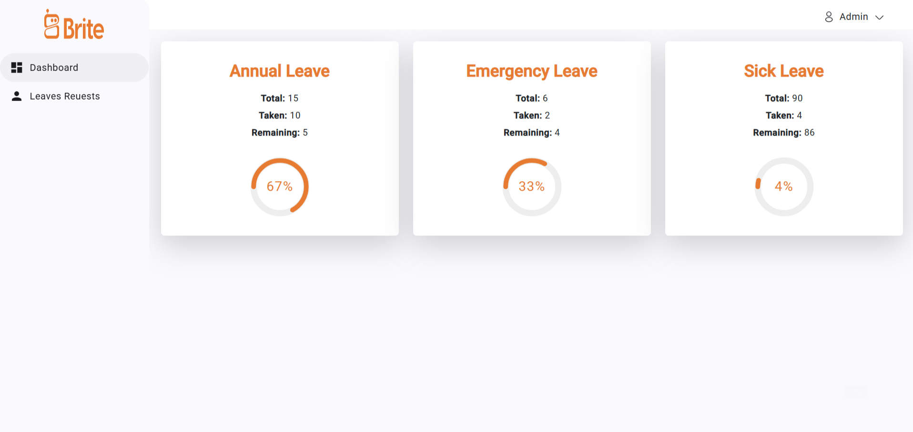
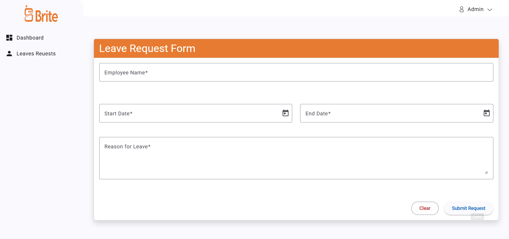
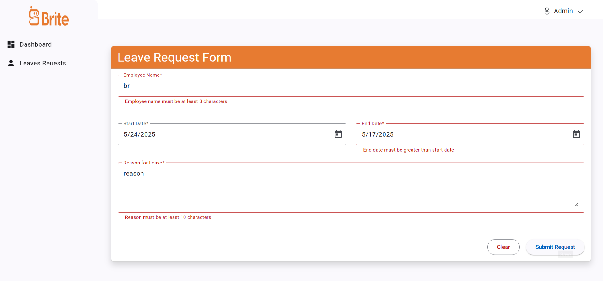
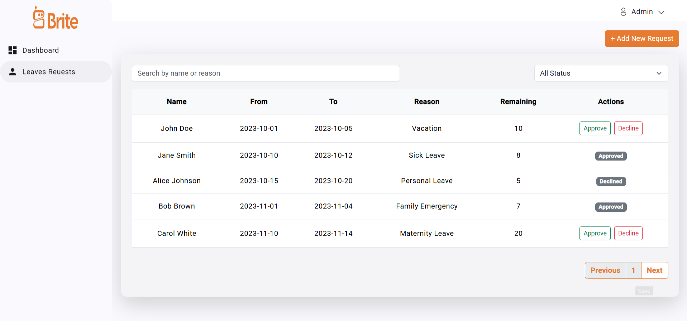
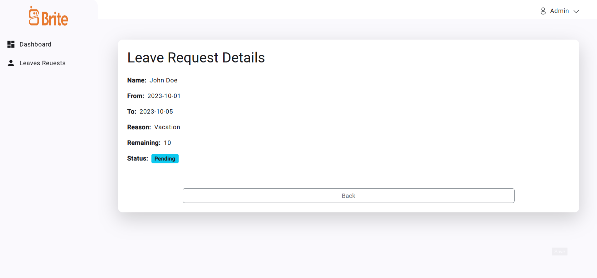

# Angular Leave Management System

A simple leave management system built using Angular 18.

---

## Features
- Dashboard Statistics
- Submit leave requests
- Approve/reject by admin
- Leave request details view
- Leave request list with filters and Pagination.

## 🛠️ Tech Stack

- Angular 18
- Angular Material
- Bootstrap
- Reactive forms with validators
- Angular Routing 
- Component-level separation and reusability (shared table)


---

## Notes 

filter , search , pagination are made in front end (for now view) , but using event emitter will send it to back end request


## Screenshots

### Dashboard


### Leave Form


### Form Validations


### Leave List


### View Leave Request


## Installation

```bash
npm install
ng serve
